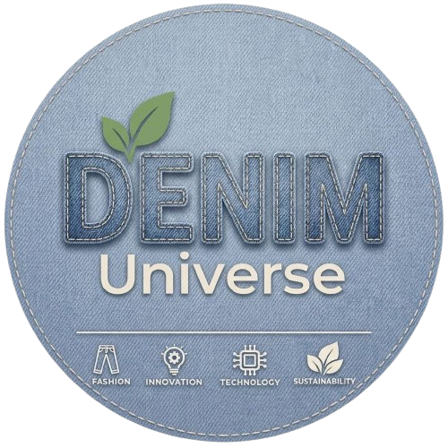

<div align="center">
  
  <h1>Denim Universe</h1>
  <p><strong>Explore the World of Denim</strong></p>
  <p>The premium denim knowledge hub: denim fabric manufacturing, indigo dyeing, weaving, troubleshooting, fashion, sustainability, technology, and industry trends.</p>
</div>

---

## 🌟 Overview

**Denim Universe** is a modern, responsive web application designed for students, textile engineers, quality control specialists, denim mills, and fashion designers. It bridges technical textile science with contemporary fashion and sustainability education.

### Key Highlights
- **🧵 9-Step Process Journey**: Interactive walkthrough from Cotton & Spinning to Rope Dyeing, Weaving, Finishing, and Garment Washing.
- **🛠️ Troubleshooting Library**: Searchable database of common denim defects, root causes, and mill-tested solutions (skew, GSM variance, shade variation, crocking, etc.).
- **🌿 Sustainability Insights**: Exploration of laser finishing, ozone wash, water recycling, and circular denim innovations.
- **✨ Official Emblem & Branding**: Custom circular embroidered denim badge and scalable vector SVG icon.

---

## 🚀 Tech Stack

- **Framework**: [React 19](https://react.dev/) + [TypeScript](https://www.typescriptlang.org/)
- **Build Tool**: [Vite 7](https://vitejs.dev/) + [vite-plugin-singlefile](https://github.com/richardtallent/vite-plugin-singlefile)
- **Styling**: [Tailwind CSS v4](https://tailwindcss.com/) with `@tailwindcss/vite`
- **Icons**: [Lucide React](https://lucide.dev/)

---

## 💻 Getting Started

### Prerequisites
- [Node.js](https://nodejs.org/) (version 18 or newer recommended)
- `npm` or `pnpm` or `yarn`

### Installation & Run

```bash
# Clone the repository
git clone https://github.com/your-username/denim-universe.git
cd denim-universe

# Install dependencies
npm install

# Start development server
npm run dev
```

### Production Build

```bash
# Build optimized production bundle
npm run build

# Preview build locally
npm run preview
```

---

## 📄 License & Credits

© 2026 Denim Universe. All rights reserved.